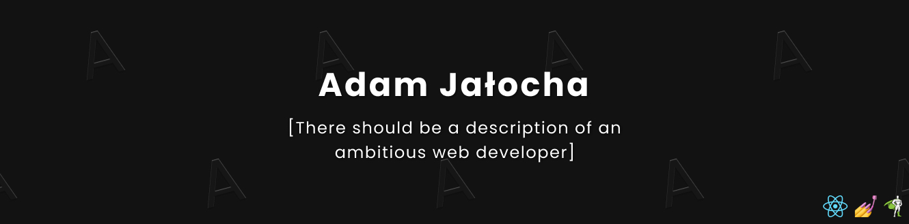
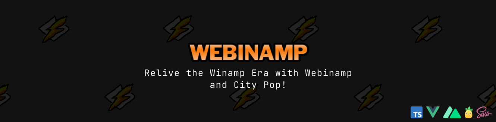
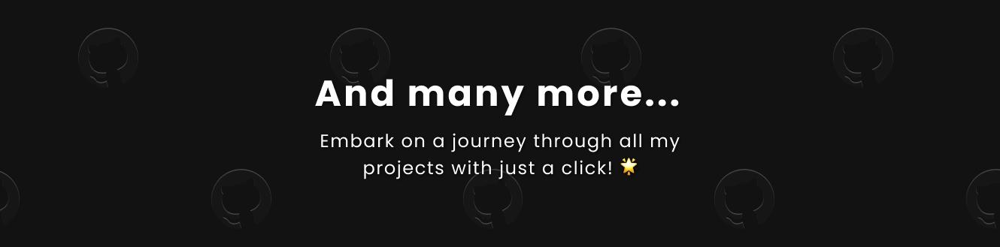

# Hi there, I'm Adam 👋

- Front-end Developer with over 3 years of experience across diverse projects, including notable contributions to hospitals (HSS) and esteemed companies like Fingoweb and Trol.
- Successfully created impactful User Interfaces for RIIP REPS at HSS, recognized as the world's premier orthopedic hospital in the USA. Contributed to enhanced user engagement and efficiency.
- Proficient in TypeScript, React, Next.js, Vue with a passion for staying updated on emerging trends.
- Actively pursue continuous learning of new technologies and best UI/UX practices.
- Engage in personal projects like emotion.miami and contribute to local community activities, creating designs for events like Drugie Życie (portfolio available at [adamjalocha.pl](https://www.adamjalocha.pl/)).

## Skills ⚡

## Featured Project ✨

<!--
## Projects 🐱

-->

<!--
**energywraith/energywraith** is a ✨ _special_ ✨ repository because its `README.md` (this file) appears on your GitHub profile.

Here are some ideas to get you started:

- 🔭 I’m currently working on ...
- 🌱 I’m currently learning ...
- 👯 I’m looking to collaborate on ...
- 🤔 I’m looking for help with ...
- 💬 Ask me about ...
- 📫 How to reach me: ...
- 😄 Pronouns: ...
- ⚡ Fun fact: ...
-->
