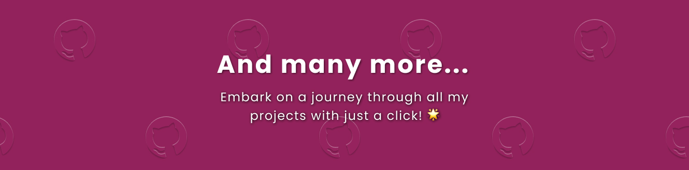

# Hi there, I'm Adam 👋

Software Engineer with 3+ years of experience building scalable, reliable systems across the stack. 
Currently at The BitByBit Company, developing ground segment software for the European Space Agency. 
Co-Founder of Emotion.miami — a digital tribute to the aesthetics and spirit of 1980s Miami, blending modern web technologies with retro design principles. 

## Skills ⚡

## Featured Project ✨

<!--
## Projects 🐱

-->

<!--
**energywraith/energywraith** is a ✨ _special_ ✨ repository because its `README.md` (this file) appears on your GitHub profile.

Here are some ideas to get you started:

- 🔭 I’m currently working on ...
- 🌱 I’m currently learning ...
- 👯 I’m looking to collaborate on ...
- 🤔 I’m looking for help with ...
- 💬 Ask me about ...
- 📫 How to reach me: ...
- 😄 Pronouns: ...
- ⚡ Fun fact: ...
-->
