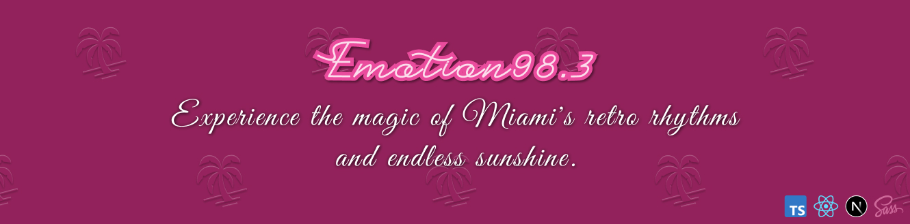

# Hi there, I'm Adam 👋

🚀 Hey there! I'm a Front-End Dev with 3+ years of experience. Worked on cool stuff for hospitals (HSS) and companies like Fingoweb and Trol. 
💻 Fluent in the language of web development, whether it's TypeScript, React, Next.js, Vue, or any other tech du jour. Always riding the wave of new trends.  
📚 Constantly learning, geeking out on tech. Also, cooking up personal projects like [Emotion 98.3](https://emotion.miami/) and adding flair to local events like Drugie Życie. Check out my creations at [adamjalocha.pl](https://www.adamjalocha.pl/)!

## Skills ⚡

## Featured Project ✨

<!--
## Projects 🐱

-->

<!--
**energywraith/energywraith** is a ✨ _special_ ✨ repository because its `README.md` (this file) appears on your GitHub profile.

Here are some ideas to get you started:

- 🔭 I’m currently working on ...
- 🌱 I’m currently learning ...
- 👯 I’m looking to collaborate on ...
- 🤔 I’m looking for help with ...
- 💬 Ask me about ...
- 📫 How to reach me: ...
- 😄 Pronouns: ...
- ⚡ Fun fact: ...
-->
